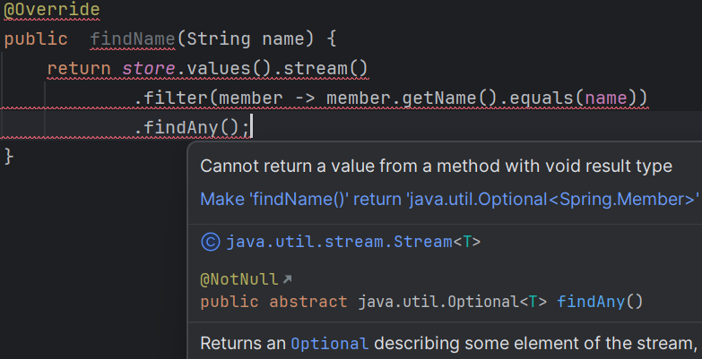
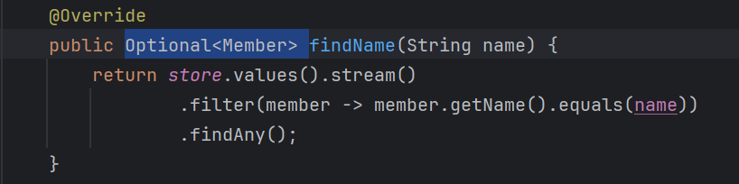
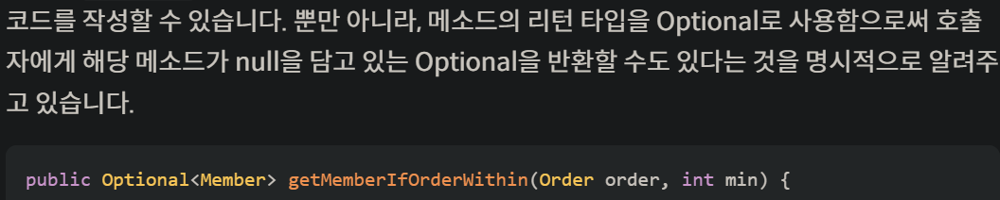
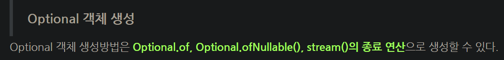
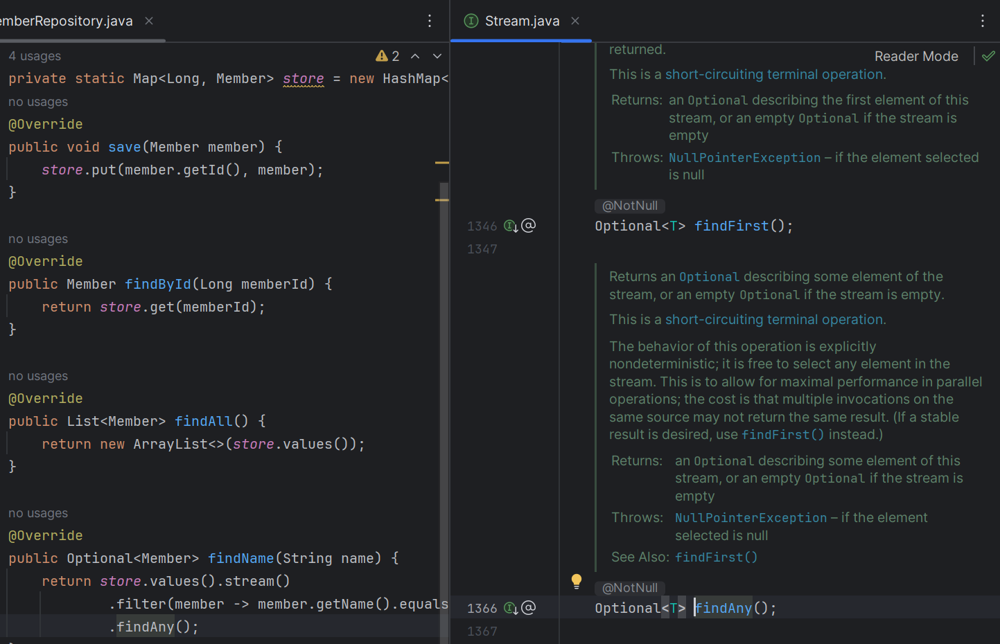
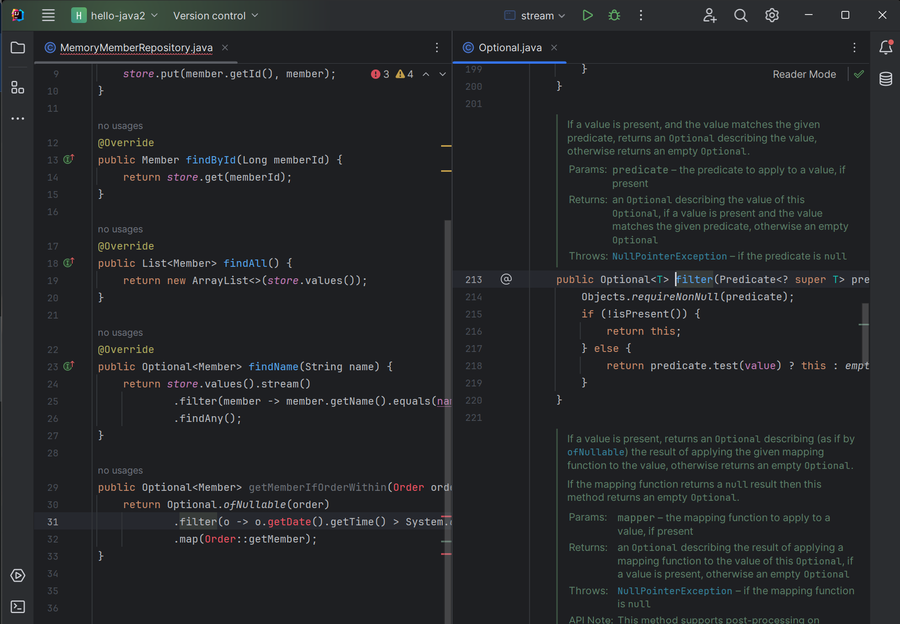
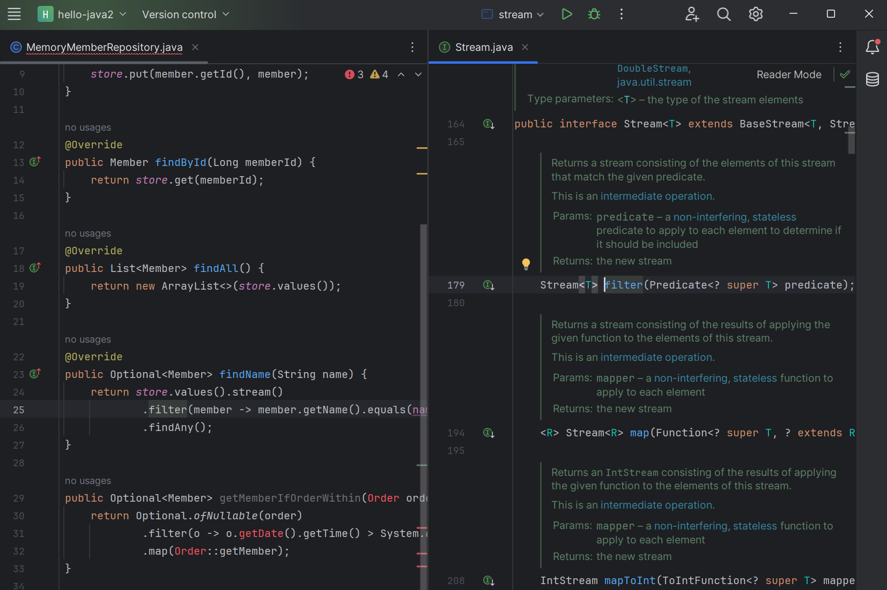

Spring Core 김영한님 강의를 듣다가  오늘은 강의 듣지 말고 지금까지 짜 온  코드들을 혼자서 짜보자고 생각해서  혼자 코드를 만들어보았다.  
그러다가 어...? 이거를 하는데 왜 Optional을 메소드의 리턴값으로 사용해야 한다고 뜨지?  
라는 생각에 찾아보게 되었다.

## 1. Stream 종료연산과 Optional

## Optional과 Stream의 연관관계를 조사

와우,,,  
결론적으로는 Stream의 종료 연산 중 Optional과 관계있는 것이 있다?!

확인해보니 Optional과 연관된 Stream의 종료연산은  
findAny(), findFirst(), min(), max(), reduce()가 있었다.  
이 종류의 종료연산을 사용할 때는 메소드의 리턴값을 Optional<T>로 해야한다.

# 2. Optional도 Stream처럼 사용할 수 있다.
optional을 stream처럼 사용할 수 있다.  
optional은 stream과 직접적인 구현이나 상속관계는 없지만 사용 방법이나 기본사상이 매우 유사하다.

stream클래스가 가지고 있는 
filter(), map(), flatMap()와 같은 메소드를 optional도 가지고 있다.

그래서 filter()을 기준으로 알아보았다.

1. 이것은 Optional을 Stream처럼 사용했을 경우  
filter()는 누구의 메소드인가를 알아보았다.  
이때 filter은 Optional의 filter()메소드였다.

2. 이것은 Stream을 사용했고Optional을 리턴타입으로 받고있는(optional연관 findAny 종료 연산을 쓰고 있어서) Stream이다.  
이것은 Stream의 filter()메소드였다.

# 결론
그냥 공부하다가 신기해서ㅎㅎ  
이것도 모른다는 마음말고 귀여운 초보자로 바라봐주면 좋겠다.ㅎㅎ

