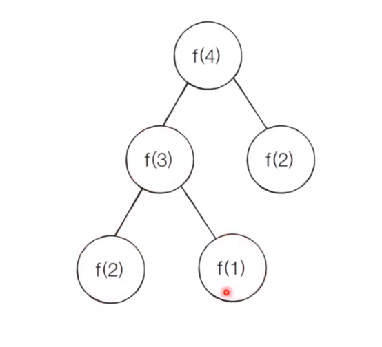
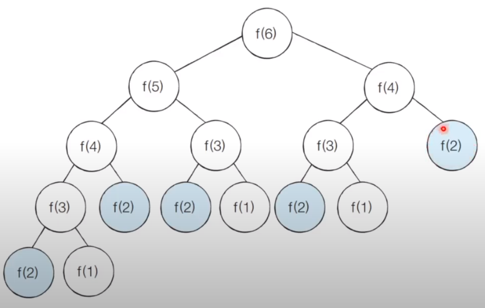
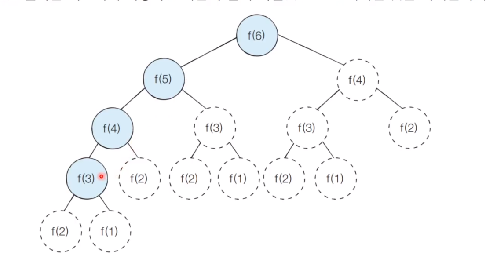

# 다이나믹 프로그래밍
메모리를 적절히 사용하여 수행 시간 효율성을 비약적으로 향상시키는 방법.  
동적 계획법이라고도 한다.

이미 계산된 결과는 별도의 메모리 영역에 저장하여 다시 계산하지 않도록 한다.  
완전탐색을 이용했을 때 매우 비효율적인 시간 복잡도를 가진다고 하더라도, 다이나믹 프로그래밍을 통해 시간을 획기적으로 줄일 수 있다.

두 가지 방식 1.탑다운 2.보텀업으로 구성.  
1. 탑다운: 위에서 부터 아래로 내려간다. 하향식이라고도 한다.
2. 보텀업: 아래에서 위로 올라간다. 상향식이라고도 한다.

일반적인 프로그래밍 분야에서의 동적과 다른 의미.  
일반적인 동적의 의미: 프로그램이 실행되는 도중에 실행에 필요한 메모리를 할당하는 방법.  
다이나믹 프로그래밍에서의 동적: 별다른 의미 없이 사용된 단어.

다이나믹 프로그래밍의 조건  
1. 최적 부분 구조: 큰 문제를 작은 문제로 나눌 수 있으며, 작은 문제의 답을 모아서 큰 문제로 해결할 수 있을 때.
2. 중복되는 부분 문제: 동일한 작은 문제를 반복적으로 해결 할 수 있을 때.

다이나믹 프로그래밍을 활용해서 해결할 수 있는 문제  
피보나치 수열 문제.  
프로그래밍에서는 수열을 배열이나 리스트를 이용해 표현한다.

f(4)를 구하는 과정. 프로그래밍에서 하는 방법: 재귀함수 -> f(3)호출 -> f(2)호출을 더한다. f(3)을 호출했을 때 f(2),f(1)을 호출하고 더한다.  


```python
def fibo(x)
    # 무한루프를 돌지 않고 특정 지점에서 멈출 수 있도록 구현해야 한다. 종료조건 명시!
    # 피보나치에서는 1번째 수, 2번째 수가 각각 1일 때는 1번째나 2번째 피보나치 수를 호출할 때 바로 1을 내보내게 한다.
    # 1번째 수와 2번째 수는 각 문제에 따라 다르다.
    if x == 1 or x == 2: 
        return 1
    return fibo(x - 1) + fibo(x - 2) # 앞쪽의 수와 두칸 앞쪽의 수를 더해 현재의 피보나치 수가 되게 만든다.
print(fibo(4))
```
단순 재귀 함수로 피보나치 수열을 해결하면 지수 시간 복잡도를 가지게 된다. 비효율적. n의 값이 커지면 기하급수적으로 더 많은 수행시간이 필요해진다.  
그리고 중복되는 문제가 생긴다.  
  
시간 복잡도: O(2^n), f(30)을 수행하려면 10억가량의 연산을 수행해야 한다,,, 웁스,,,

# 다이나믹 프로그래밍으로 피보나치 문제 풀기.
한번 해결한 문제에 대해서 그 문제의 답을 알려줄 수있도록 그 정보를 메모리에 넣으면 계산할 필요가 없어진다.

피보나치 문제는 큰 문제를 작은 문제로 나눌 수 있다.  
f(4)를 해결하기 위해(큰 문제) f(3)+f(2)을 (작은 문제 2개를 해결한 결과값) 가지고 있으면 된다.

동일한 작은 문제를 반복적으로 해결한다.  
f(4)를 해결되는 과정에서 f(3)+f(2)의 동일한 반복 문제가 해결될 수 있다.(f(n)을 해결하는 동안 반복되는 f(n-1)+ f(n-2)문제 해결)

방법: 상향식과 하향식.  
탑다운 방식-하향식    
=> 메모이제이션: 한 번 계산한 결과를 메모리 공간에 메모하는 기법.  
같은 문제를 다시 호출하면 메모했던 결과를 그대로 가져온다.  
값을 기록해 놓는다는 점에서 캐싱이라고도 한다.  
그래서 다이나믹 프로그래밍에서 사용하는 배열이름을 d, 메모리 등이라고 한다.  
큰 문제를 해결하기 위해서 작은 문제들을 재귀적으로 호출하여 그 작은 문제들이 해결 되었을 때 실제로 큰 문제에 대한 답까지 얻는 과정.  
메모이제이션은 이전에 계산된 결과를 일시적으로 기록해 놓는 넓은 개념을 의미한다.  
따라서 메모이제이션은 다이나믹 프로그래밍에 국한된 개념은 아니다.  
한 번 계산된 결과를 담아 놓기만 하고 다이나믹 프로그래밍을 위해 활용하지 않을 수도 있다.

보텀업 - 상향식  
아래부터 작은 문제들을 하나씩 해결해 나가면서 먼저 계산한 문제들의 값을 해결해서 그 다음의 문제까지 해결하는 특징.  
반복문을 사용한다.  
다이나믹 프로그래밍의 전형적인 형태는 보텀업 방식이다.  
결과 저장용 리스트는 DP 테이블이라고 부른다.

# 탑 다운 메모제이션으로 피보나치 풀기
색칠된 부분만 풀고 값을 메모리에 저장해 놓으면 반복되는 문제들을 메모리에서 찾아 값을 바로 넣을 수 있다.  


```python
# 한 번 계산된 결과를 메모제이션 하기 위한 리스트 초기화
d = [0] * 100
#피보나치 함수를 재귀함수로 구현
def fibo(x):
    #종료 조건(1 혹은 2일 때 1을 반환)
    if x == 1 or x == 2:
        return 1
    #이미 계산한 적 있는 문제라면 그대로 반환.
    if d[x] != 0:
        return d[x]
    #아직 계산하지 않은 문제라면 점화식에 따라서 피보나치 결과 반환
    d[x] = fibo(x-1) + fibo(x-2)
    return d[x]

print(fibo(99)) #  1. 99번째 값을 찾으려고 한다.
```

보텀업 방식으로 피보나치 문제 풀기  
```python
# 앞서 계산된 결과를 저장하기 위한 DP 테이블 초기화.
d = [0] * 100

#첫 번째 피보나치 수와 두 번째 피보나치 수는 1
d[1] = 1
d[2] = 1
n = 99

#피보나치 함수를 반복문으로 구현
for i in range(3, n+1):
    d[i] = d[i-1] + d[i-2]

print(d[n])
```

# 다이나믹 프로그래밍 문제에 접근하는 방법
주어진 문제가 다이나믹 프로그래밍 유형임을 파악하는게 중요하다.

가장 먼저 그리디, 구현, 완전 탐색 등의 아이디어로 문제를 해결할 수 있는지 검토할 수 있다.  
다른 알고리즘 풀이 방법이 떠오르지 않는다면 다이나믹 프로그래밍을 고려해 보자.

일단 재귀함수로 비효율적인 완전 탐색 프로그램을 작성한 뒤에 작은 문제에서 구한 답이 큰 문제에서 그대로 사용될 수 있으면,  
코드를 개선하는 방법을 사용할 수 있다.

일반적인 코딩 테스트 수준에서는 기본 유형의 다이나믹 프로그래밍 문제가 출제되는 경우가 많다.

